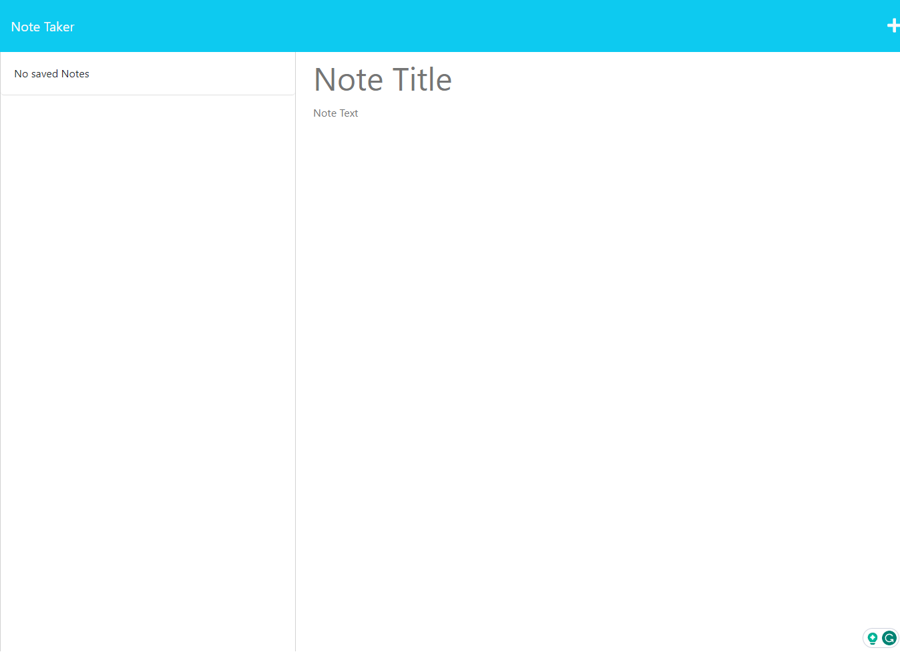

# Note-Taker
  

  ## Description
  This had me write server side logic for the a note taker app. All my work can be found in the server.js
  
  ## Table of Contents
  - [Installation](#installation)
  - [Usage](#usage)
  - [Contributing](#contributing)
  - [Tests](#tests)
  - [License](#license)
  - [Questions](#questions)
  ## License

This project is licensed under the [MIT](https://opensource.org/licenses/MIT) License.
  
  ## Installation
  No specific installation at the moment.
  
  ## Usage

 https://dry-scrubland-72592-bcf3618c9342.herokuapp.com/notes

 ##ScreenShot
 
  
  ## Contributing
  No specific contribution guidlines at the moment.
  
  ## Tests
  No specific tests at the moment.
  
  ## Questions
  For any questions or feedback, please feel free to contact me:
  - GitHub: [jlausier](https://github.com/jlausier)
  - Email: jakelausier7878@gmail.com
  